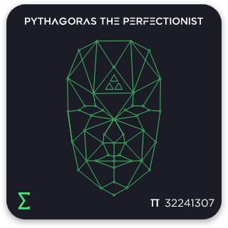

# Minting Metamaticians

DeFrag will launch in phases, gradually adding features as the protocol matures.

In order to provide a frictionless borrowing experience, the protocol needs to raise liquidity which will be used to underwrite initial put options. This is where _Metamaticians_ come in.&#x20;

Metamaticians are randomly generated NFTs based on famous mathematicians and come with a stake in the first Underwriting Pool to earn premium fees. In phase one, 3,141 Metamaticians will be available to mint for a set price of 1.618 ETH each and serve as an entry ticket into the DeFrag universe of NFT collateralized loans. During the mint, a random 8 digit number and a greek symbol associated with risk in pricing out financial instruments are generated + assigned to each Metamatician.&#x20;

The 8 digit number is your place in the number Pi following the decimal. The proximity of your number to “3.” will determine the rarity of your NFT. Which in turn will boost your abilities in our financial ecosystem. A few examples include - improving your collateral ratio in other words the ability to borrow more. Another example is increasing your stake in a liquidity pool. Once the protocol is live, community will be able to vote in other interesting dynamic variables to be derived from 8 random numbers + real world events.&#x20;

90% of all minting proceeds (-10% core team vesting) are automatically deposited into the DeFrag DAO Treasury. Once the community votes in the initial NFT project to be used as collateral, ETH will be transferred over from the Treasury into that initial underwriting pool. As borrowers begin to take out loans, the protocol will automatically issue required # of NFT put options and lock up required ETH to underwrite them.

